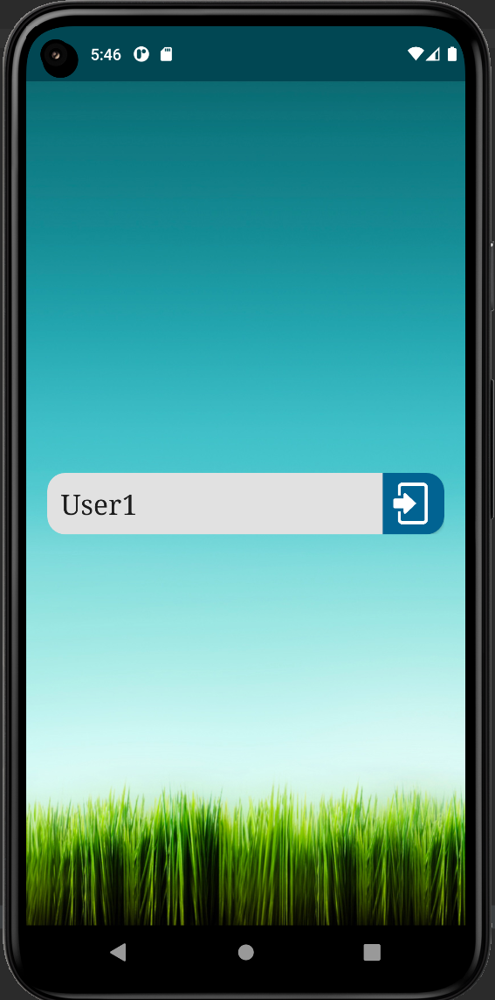
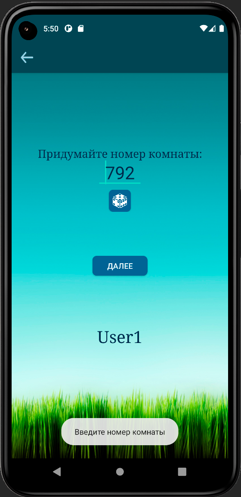
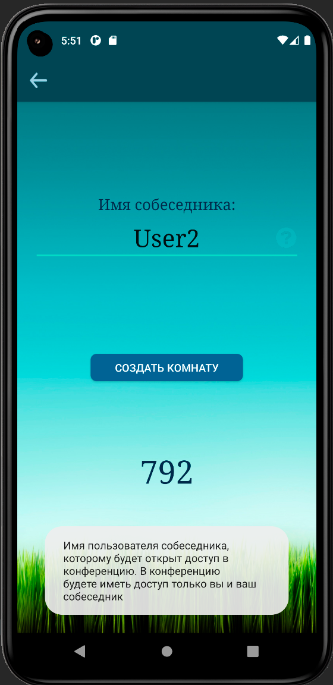
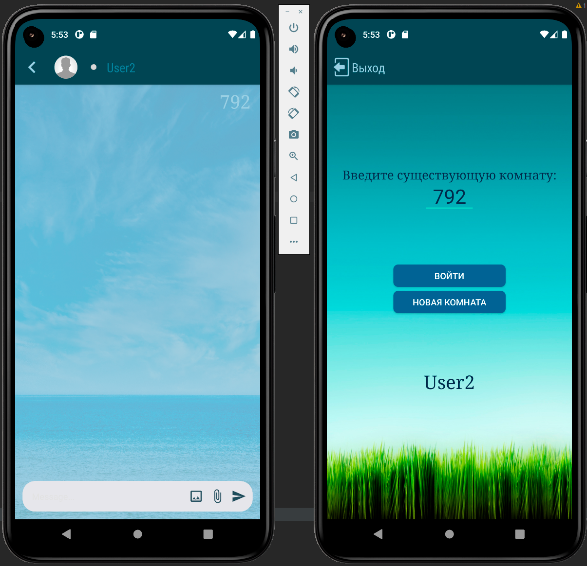
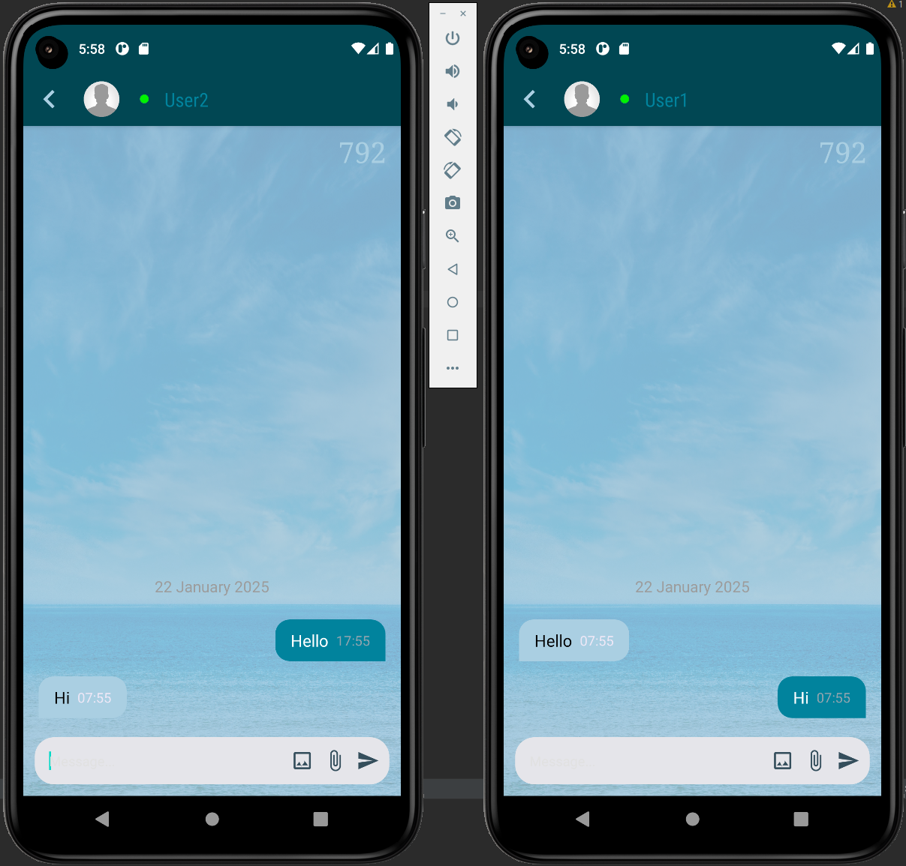

# PrivateMessenger

A small messenger that uses the AES256 encryption algorithm. For security, a one-time nickname and the number of the created room are used. Only a user who knows the room number and uses the username specified by the room creator can join the chat. After the room is closed, the conversation is permanently deleted.

## Specify your one-time nickname

## Specify a new room number or generate one

## Specify a nickname of the second user

## Create the room. After this, the second user specifies the room number

## You can start your conversation
